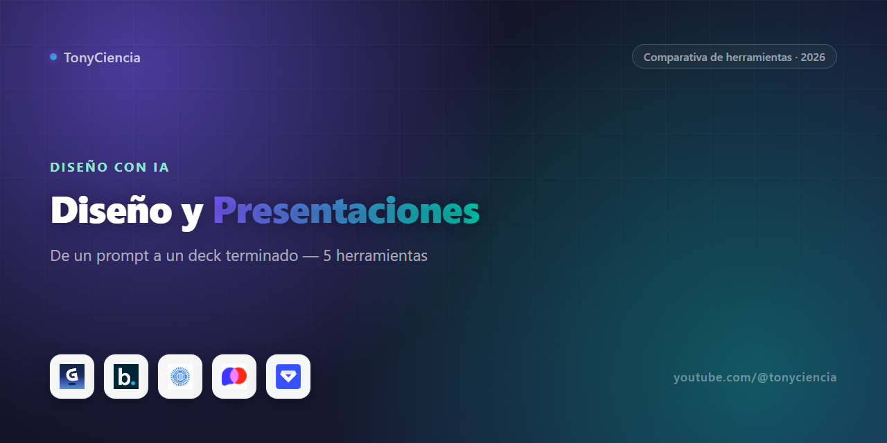

# Presentaciones y diseño con IA: de un prompt a un deck terminado (2026)

Hacer una presentación pasó de ser "arrastrar cajas de texto en PowerPoint durante dos horas" a "escribir lo que necesitás y editar lo que sale". Eso ya casi no se discute. Lo que sí cambia mucho de una herramienta a otra es *qué parte* del trabajo le delegás a la IA: hay quien te genera el deck entero desde una idea suelta, hay quien te ayuda a diseñar mientras vos seguís escribiendo, y hay quien directamente tira el formato de diapositivas por la ventana. Probamos esos ángulos para armar esta comparativa.

## La comparativa corta

| | Herramienta | Para qué sirve | Link |
|---|---|---|---|
|  | **Beautiful.ai** | Presentaciones que se auto-diseñan mientras escribís el contenido | [Probar →](https://beautifulai.partnerlinks.io/a9w9832hbrbt) |
|  | **PopAi** | Asistente de IA para crear y editar presentaciones/documentos | [Probar →](https://01aipteltd.pxf.io/c/6249333/3106551/38580) |
|  | **Prezi** | Presentaciones no lineales con zoom y movimiento — el clásico "anti-PowerPoint" | [Probar →](https://try.prezi.com/ok37tgp9wyu0-qpqdwb) |
|  | **Logome.ai** | Generador de logos con IA | [Probar →](https://logomeai.partnerlinks.io/wkor99fg7w1n) |

---

## De un prompt a un primer borrador: PopAi

**PopAi** parte de una promesa simple: le tirás una idea en una línea y te devuelve una presentación armada, con texto, estructura y diseño ya puestos. La diferencia con simplemente "generar y listo" es que se queda ahí como asistente integral durante todo el proceso — te ayuda a reescribir secciones, resumir un PDF que subiste, o convertir notas sueltas en slides sobre la marcha. No es solo un generador de primer borrador: es un copiloto que sigue trabajando con vos hasta que el deck queda terminado.

## Diseño automático mientras vos seguís escribiendo

**Beautiful.ai** resuelve un problema distinto al de generar todo desde cero: es para cuando ya sabés qué querés decir y lo que te frena es el diseño. Vas escribiendo el contenido diapositiva por diapositiva y la herramienta reacomoda elementos, alinea, ajusta tamaños y mantiene consistencia visual en tiempo real — como tener a alguien de diseño corrigiendo detrás tuyo sin que se lo pidas. No arranca de un prompt gigante como PopAi; arranca de vos escribiendo, y el valor está en que nunca termines con una diapositiva que se ve amateur por accidente.

## El formato no lineal: cuándo tiene sentido Prezi

**Prezi** es el outlier de esta lista porque no compite en "qué tan rápido genera slides con IA" — compite en un formato distinto por completo. En vez de una secuencia de diapositivas fijas, trabajás sobre un lienzo grande donde la presentación se mueve con zooms y paneos entre ideas conectadas. Tiene sentido cuando la historia que estás contando es literalmente no lineal — mostrar cómo una idea central se conecta con varias ramas, un pitch donde querés que el público sienta que recorre un mapa en vez de pasar páginas — y pierde sentido para un reporte trimestral estándar o un deck de ventas convencional, donde el formato lineal de las otras tres herramientas de esta lista simplemente comunica mejor.

## Aparte: Logome.ai no es una herramienta de presentaciones

Vale aclararlo porque está en la misma lista pero resuelve otra cosa: **Logome.ai** genera logos con IA, no diapositivas. La sumamos acá porque diseñar la identidad de una marca y armar la presentación que la muestra suelen pasar en el mismo proyecto, y para alguien que necesita ambas cosas rápido tiene sentido tenerlas a mano juntas — pero es una herramienta de nicho distinto, no una alternativa a ninguna de las tres de arriba.

## Cómo armamos esta comparativa

Las cuatro herramientas de esta lista son programas de afiliado con los que tenemos una relación activa — probamos cada producto antes de sumarlo, y solo entran acá los que están vigentes hoy. No cobramos por posición ni las ordenamos por comisión: separamos a Beautiful.ai y Prezi porque resuelven problemas distintos entre sí y del resto, y le dimos su propio párrafo aparte a Logome.ai en vez de forzarla dentro de la comparativa de presentaciones solo porque comparte categoría de "diseño con IA". Si un programa deja de tener sentido para el canal o el partnership se cae, sale de la lista.

## Preguntas frecuentes

**¿Por qué no está Gamma en esta lista?**
Estuvo, pero salió del catálogo de partners activos del canal: verificamos contra PartnerStack y el programa ya no está vigente. Como regla, acá solo listamos herramientas con partnership activa, así que la sacamos apenas confirmamos el cambio.

**¿Prezi sirve para reemplazar a las otras tres?**
No para todo. Si tu presentación es una secuencia estándar de puntos — reporte, pitch de ventas clásico, clase — el formato lineal de PopAi o Beautiful.ai comunica mejor. Prezi gana cuando la idea central se ramifica y querés que el público lo sienta visualmente.

**¿Por qué Logome.ai está en una comparativa de presentaciones?**
Porque diseñar el logo y armar el deck que lo presenta suelen ser parte del mismo proyecto, no porque sea una alternativa a las herramientas de arriba. Es logos, no diapositivas — lo aclaramos en su propia sección para no mezclar peras con nada parecido a una pera.

---

### Sobre este repo

Esta comparativa la mantiene [TonyCiencia](https://youtube.com/@tonyciencia). Los links de arriba son de afiliado: entrar por acá no te cuesta nada extra, y si te suscribís a alguna herramienta ayuda a sostener el contenido del canal. Solo aparecen productos con los que tenemos una relación de partner activa — no hay testimonios inventados ni experiencias de uso que no tuvimos.

Última actualización: 2026-08-17.
